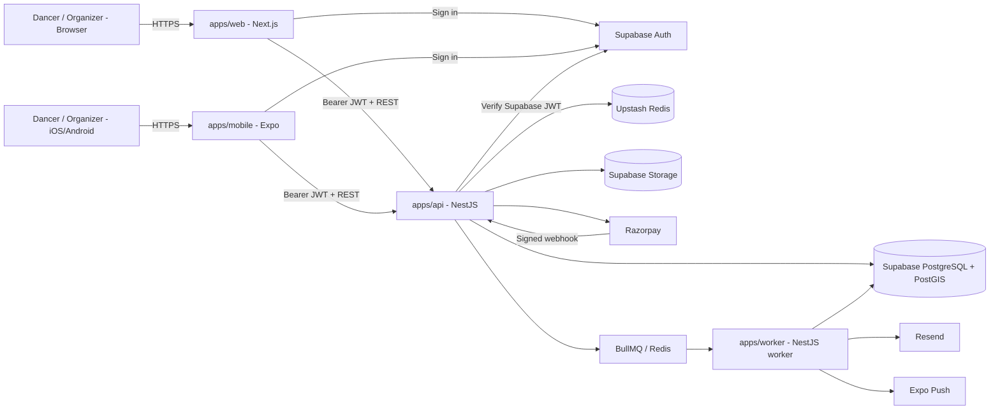
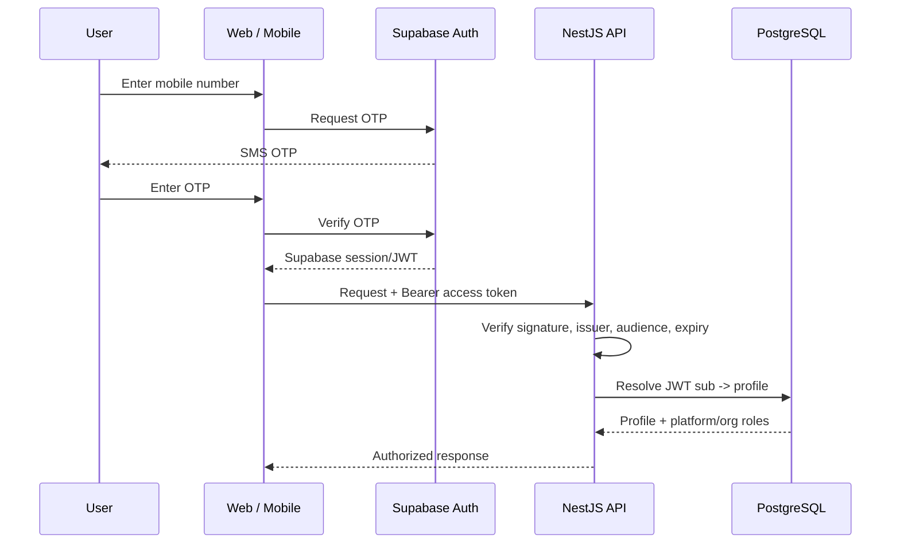
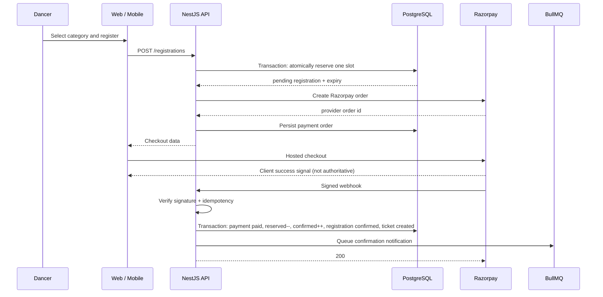

# Underground Dance Event Platform — Phase 1
## Technical Blueprint (Cursor / Monorepo Build)

**Prepared for:** Portfolio / Startup Project
**Role:** Product & Technical Lead
**Scope:** Phase 1 MVP only (per the PRD's own §15/§16 — Phase 2–4 features explicitly excluded)
**Document Type:** Engineering Design Report (v3.0 — Cursor build, NestJS backend revision)

---

## 0. Executive Summary

This blueprint describes a real product with real money moving through it (Razorpay), not just a UI skill demo. Security, payment correctness, authorization, concurrency, data integrity, observability, and failure handling are therefore treated as first-class engineering requirements.

**Repository:** one **Turborepo monorepo** containing `apps/web` (Next.js), `apps/mobile` (Expo/React Native), `apps/api` (NestJS), `apps/worker` (background jobs), and shared packages.

**Backend decision — revised:** use a **NestJS modular monolith** as the application backend for both web and mobile. Keep **Supabase as managed infrastructure** for PostgreSQL/PostGIS, Authentication, and small-object Storage. Do not use Supabase Edge Functions as the primary application backend. This gives the project a real backend architecture to showcase while avoiding the unnecessary work of rebuilding auth, database hosting, and object storage.

**Client access rule:** web and mobile authenticate with Supabase Auth, then call the NestJS API using the Supabase access token as a Bearer JWT. Core application tables are not written directly from the clients. NestJS owns business rules, authorization, registration capacity, payments, admin operations, and write-side workflows.

**Phase 1 authentication:** mobile number + SMS OTP only. No password login, email login, or Google OAuth in the MVP. Supabase handles OTP verification/JWT issuance; NestJS remains the authorization and business-logic boundary.

**UI decision — revised:** `my-ui-library` is removed completely. The web app uses project-local **shadcn/ui + Tailwind** components; the mobile app uses project-local **React Native + NativeWind** components. Only design tokens and non-visual logic are shared.

**Mobile strategy:** Expo/React Native remains the right choice. The web and mobile applications share API contracts, schemas, types, data clients, business helpers, and design tokens, but keep platform-specific screens/components instead of forcing DOM and React Native UI into one abstraction.

**Visual identity:** the "Night Cypher" system remains fixed across web and mobile: dark surfaces, bold condensed typography, orange primary actions, acid-lime status accents.

**Phase 1 scope:** dancer auth/profile, event discovery/filters, event detail, registration/payment, digital tickets, My Events, organizer dashboard/event creation, registration management, video archive, admin verification/moderation.

**Explicitly out of scope:** social feed, comments, likes, DMs, crew management, rankings, judge scoring, tournament brackets, livestreams, and reels/short-video feed.

## 1. Architecture

### Chosen architecture: Modular Monolith + Background Worker

This **is** an application-architecture decision now. The system should use one NestJS backend with strict domain modules rather than direct client-to-database CRUD as the primary application model.

| Option | Verdict | Reasoning |
|---|---|---|
| Supabase-only client CRUD + Edge Functions | ❌ Not chosen as the primary backend | Excellent for a fast MVP, but it hides too much backend architecture for this portfolio goal and scatters critical workflows between clients, RLS, SQL functions, and Edge Functions |
| Microservices | ❌ Rejected for Phase 1 | Premature distributed-system complexity; registration/payment workflows benefit from a single transactional boundary |
| **NestJS modular monolith + worker** | ✅ **Chosen** | Strong domain boundaries, testable services, explicit API contracts, centralized authorization/business logic, straightforward transaction handling, and a clean path to future service extraction |
| Supabase managed services | ✅ **Retained** | Use Supabase for hosted PostgreSQL/PostGIS, Auth, and small-object Storage instead of rebuilding commodity infrastructure |

### Backend ownership

NestJS owns:

- users/profiles application logic;
- organizers and organizer membership;
- event/category CRUD;
- registration reservations and capacity concurrency;
- Razorpay order creation, webhooks, refunds, and idempotency;
- tickets;
- admin workflows;
- authorization;
- media metadata;
- notification orchestration;
- audit logging.

Supabase owns:

- managed PostgreSQL/PostGIS hosting;
- Supabase Auth identity lifecycle;
- poster/avatar object storage;
- optional Realtime subscriptions only where they materially improve UX.

The browser/mobile apps **must not directly mutate core domain tables**. Reads can also go through the API so authorization, caching, response contracts, and observability remain consistent across web and mobile.

### 1.1 Mobile Strategy — Expo / React Native

| Option | Verdict | Reasoning |
|---|---|---|
| Capacitor | ❌ Rejected | WebView wrapping gives lower native UX ceiling and is unnecessary when Cursor can work comfortably with React Native |
| Separate mobile repository | ❌ Rejected | Unnecessary duplication of API contracts, validation, configuration, and release tooling |
| **Expo + React Native inside the monorepo** | ✅ **Chosen** | Real native app, excellent TypeScript/React fit, EAS builds, native notifications/camera support, and clean sharing of non-visual code |

**Do not use Solito initially.** Next.js App Router and Expo Router are both good on their own. Sharing routing abstractions adds complexity without enough benefit because web and mobile navigation patterns are deliberately different. Share route constants/deep-link helpers only if useful.

### 1.2 What Is Shared vs Platform-Specific

| Shared | Platform-specific |
|---|---|
| API request/response contracts | Next.js route/layout components |
| Zod schemas | Expo Router screens/navigation |
| Generated/typed API client | Web shadcn/ui components |
| Date, money, event, registration helpers | React Native/NativeWind components |
| Auth token helper interfaces | Native push/camera integrations |
| Analytics event names | Web-only SEO/metadata |
| Night Cypher design tokens | Platform-specific interaction patterns |

The goal is **shared business logic, not forced shared UI**.

## 2. Tech Stack

| Layer | Choice | Why |
|---|---|---|
| Monorepo | **Turborepo + pnpm workspaces** | One repository for web, mobile, API, worker, and shared packages |
| Web | **Next.js (current stable, App Router) + React + TypeScript** | SEO/public event pages, organizer/admin dashboards, modern React architecture |
| Web UI | **Tailwind CSS + shadcn/ui (project-local)** | Accessible primitives without a dependency on `my-ui-library` |
| Mobile | **Expo + React Native + TypeScript + NativeWind** | Native iOS/Android app with strong React/TS developer experience |
| Mobile routing | **Expo Router** | File-based native routing and deep-link support |
| Validation | **Zod** | Shared request/form validation contracts |
| Web forms | **React Hook Form** | Mature form handling |
| Backend | **NestJS modular monolith** | Explicit application architecture, dependency injection, guards, validation, testability |
| Background jobs | **NestJS worker + BullMQ** | Reservation expiry, notifications, exports, media jobs; independently scalable process |
| Queue/cache | **Redis (Upstash initially)** | BullMQ backend, rate limiting, cache, ephemeral coordination |
| ORM | **Prisma** | Typed data access, migrations, transactions |
| Database | **Supabase PostgreSQL + PostGIS** | Managed relational DB plus geospatial event discovery |
| Auth | **Supabase Auth — Phone number + OTP only (Phase 1)** | Fast mobile-first authentication for web/mobile; Supabase verifies OTP and issues JWTs, NestJS verifies JWTs and owns authorization |
| Payments | **Razorpay** | India-first checkout; all authoritative operations server-side in NestJS |
| Small asset storage | **Supabase Storage** | Posters and avatars |
| Phase 1 video | **YouTube unlisted embeds** | Avoid premature video transcoding/storage infrastructure |
| Email | **Resend** | Transactional email |
| Push | **Expo Notifications** | Native push for Expo apps |
| Observability | **Sentry + structured logs + OpenTelemetry-ready instrumentation** | Frontend/API/worker diagnostics |
| Web hosting | **Vercel** | Next.js deployment |
| API/worker hosting | **Railway/Fly.io/Render initially; ECS/Fargate later if needed** | Low-friction MVP deployment with a clear scale-up path |
| Mobile builds | **EAS Build / Submit** | Android/iOS build and release workflow |
| CI/CD | **GitHub Actions** | lint/typecheck/test/build/deploy gates |

### Not needed in Phase 1

- LLM;
- vector database;
- model serving;
- prompt-engineering layer;
- microservices;
- OpenSearch/Elasticsearch;
- Kafka.

## 3. Component Sourcing — Project-Local Only

external portfolio UI library is **not used anywhere in this project**.

### Web

Use:

- `shadcn/ui` components installed into `apps/web`;
- Tailwind CSS;
- local feature components under `apps/web/components` and `apps/web/features`.

Examples:

- Button
- Dialog
- Tabs
- FormField
- DropdownMenu
- Sheet
- Table
- Badge
- Tooltip

Because shadcn/ui copies component source into the repository, it remains fully customizable for the Night Cypher visual identity.

### Mobile

Use:

- React Native primitives;
- NativeWind;
- project-local primitives under `apps/mobile/components/ui`.

Do not attempt to import shadcn/Radix DOM components into React Native.

### Shared UI decision

Do **not** create a large cross-platform `packages/ui` in Phase 1. The actual reusable layer should be `packages/tokens`, `packages/contracts`, `packages/validation`, `packages/api-client`, and `packages/utils`.

If a genuinely platform-neutral component emerges later, extract it deliberately. Do not pre-abstract UI before the two platforms prove that abstraction is useful.

## 3.1 Design System — "Night Cypher"

This applies identically across `apps/web`, `apps/mobile`, and should match your existing marketing site — one token set, three surfaces.

**Color tokens** (as CSS variables / Tailwind config, not hardcoded hex scattered through components):

```css
:root {
  --bg:            #0A0A0A;
  --surface:       #121212;
  --elevated:      #1A1A1A;
  --border:        #2A2A2A;

  --text-primary:   #F5F5F5;
  --text-secondary: #A3A3A3;
  --text-muted:     #737373;

  --accent-primary:       #FF4D00;
  --accent-primary-hover: #FF6A2B;
  --accent-secondary:     #DFFF00;  /* tags, status chips */

  --success: #22C55E;
  --warning: #F59E0B;
  --error:   #EF4444;
}
```

```js
// tailwind.config.js — extend, don't override, so shadcn/ui defaults stay intact
theme: {
  extend: {
    colors: {
      bg: "var(--bg)", surface: "var(--surface)", elevated: "var(--elevated)",
      border: "var(--border)",
      "text-primary": "var(--text-primary)", "text-secondary": "var(--text-secondary)",
      accent: { DEFAULT: "var(--accent-primary)", hover: "var(--accent-primary-hover)" },
      "accent-2": "var(--accent-secondary)",
    },
    fontFamily: {
      display: ["Bebas Neue", "sans-serif"],
      body: ["Barlow", "sans-serif"],
    },
  },
}
```

**Typography:** Bebas Neue (bold condensed) for headlines and event titles — the "street poster" feel the PRD's whole underground aesthetic depends on; Barlow for body text, form fields, and dashboard tables where readability matters more than impact. Both are free via Google Fonts — no licensing cost. Tight-tracked uppercase kickers (small label text above headlines) reinforce the poster look.

**This app is dark-only by design — no light mode.** That's a deliberate departure from the portfolio site's day/night toggle system (a different project with a different goal); here, dark is the entire brand identity, not a preference to accommodate. As a side benefit worth mentioning: an always-dark UI is genuinely lighter on battery for OLED phone screens — a real, if minor, mobile-specific upgrade over a toggleable theme.

**Motion:** matches the PRD's "subtle scroll/hover motion only" instruction directly — Framer Motion used the same restrained way as the portfolio site (§9.1 there), never as decoration. Acid-lime (`--accent-secondary`) tag chips get a small hover/press scale, nothing more.

**Sharing tokens with the existing marketing site:** unlike components (§3), tokens are cheap to share — copy the CSS variable file into both projects (or, once both are stable, extract just the token file, not components, into a tiny shared package). No live dependency, no tooling conflict — just the same values kept in sync by hand or via a plain file copy.

---

## 4. System Architecture Diagram



**One backend serves both clients.** The clients share API contracts but not business-rule implementations. Supabase is infrastructure; NestJS is the application backend.

## 5. Database Schema

Use Prisma migrations as the normal application migration mechanism. PostGIS-specific extension/index SQL can live in explicit SQL migrations where Prisma needs assistance.

```sql
create extension if not exists postgis;

create table profiles (
    id              uuid primary key references auth.users(id) on delete cascade,
    name            text not null,
    dancer_name     text,
    city            text,
    crew            text,
    styles          text[],
    instagram       text,
    avatar_url      text,
    platform_role   text not null default 'user' check (platform_role in ('user','admin')),
    status          text not null default 'active' check (status in ('active','suspended','deleted')),
    created_at      timestamptz not null default now(),
    updated_at      timestamptz not null default now()
);

create table organizers (
    id                  uuid primary key default gen_random_uuid(),
    org_name            text not null,
    slug                text not null unique,
    city                text,
    verification_status text not null default 'pending' check (verification_status in ('pending','verified','rejected')),
    bio                 text,
    banner_url          text,
    logo_url            text,
    instagram           text,
    created_by          uuid not null references profiles(id),
    created_at          timestamptz not null default now(),
    updated_at          timestamptz not null default now()
);

create table organizer_members (
    organizer_id uuid not null references organizers(id) on delete cascade,
    user_id      uuid not null references profiles(id) on delete cascade,
    role         text not null check (role in ('owner','manager','editor')),
    created_at   timestamptz not null default now(),
    primary key (organizer_id, user_id)
);

create table events (
    id                      uuid primary key default gen_random_uuid(),
    organizer_id            uuid not null references organizers(id) on delete cascade,
    slug                    text not null unique,
    title                   text not null,
    description             text,
    event_type              text not null default 'battle',
    city                    text not null,
    venue                   text,
    location                geography(Point, 4326),
    start_time              timestamptz not null,
    end_time                timestamptz,
    registration_opens_at   timestamptz,
    registration_closes_at  timestamptz,
    poster_url              text,
    status                  text not null default 'draft' check (status in ('draft','published','registration_closed','completed','cancelled')),
    created_at              timestamptz not null default now(),
    updated_at              timestamptz not null default now()
);

create index events_location_idx on events using gist (location);
create index events_status_start_idx on events(status, start_time);
create index events_city_start_idx on events(city, start_time);

create table event_categories (
    id               uuid primary key default gen_random_uuid(),
    event_id         uuid not null references events(id) on delete cascade,
    name             text not null,
    price_minor      integer not null default 0,
    capacity         integer not null,
    reserved_count   integer not null default 0,
    confirmed_count  integer not null default 0,
    team_size        integer not null default 1,
    check (reserved_count >= 0),
    check (confirmed_count >= 0),
    check (reserved_count + confirmed_count <= capacity)
);

create table registrations (
    id                    uuid primary key default gen_random_uuid(),
    user_id               uuid not null references profiles(id),
    event_id              uuid not null references events(id),
    category_id           uuid not null references event_categories(id),
    payment_status        text not null default 'pending' check (payment_status in ('pending','paid','refunded','failed')),
    registration_status   text not null default 'pending_payment' check (registration_status in ('pending_payment','confirmed','waitlist','expired','cancelled','refunded')),
    reservation_expires_at timestamptz,
    total_amount_minor    integer not null,
    registration_code     text not null unique,
    ticket_qr_token       text unique,
    created_at            timestamptz not null default now(),
    confirmed_at          timestamptz,
    unique (user_id, category_id)
);

create table registration_participants (
    id              uuid primary key default gen_random_uuid(),
    registration_id uuid not null references registrations(id) on delete cascade,
    user_id         uuid references profiles(id),
    display_name    text not null,
    dancer_name     text,
    email           text,
    is_team_captain boolean not null default false
);

create table payment_orders (
    id                  uuid primary key default gen_random_uuid(),
    registration_id     uuid not null references registrations(id),
    provider            text not null default 'razorpay',
    provider_order_id   text not null unique,
    amount_minor        integer not null,
    currency            text not null default 'INR',
    status              text not null default 'created',
    created_at          timestamptz not null default now(),
    updated_at          timestamptz not null default now()
);

create table payments (
    id                  uuid primary key default gen_random_uuid(),
    payment_order_id    uuid not null references payment_orders(id),
    provider_payment_id text not null unique,
    amount_minor        integer not null,
    status              text not null,
    method              text,
    created_at          timestamptz not null default now()
);

create table payment_webhook_events (
    id                uuid primary key default gen_random_uuid(),
    idempotency_key   text not null unique,
    event_type        text not null,
    payload           jsonb not null,
    processing_status text not null default 'received',
    received_at       timestamptz not null default now(),
    processed_at      timestamptz,
    error             text
);

create table videos (
    id              uuid primary key default gen_random_uuid(),
    event_id        uuid not null references events(id) on delete cascade,
    category_id     uuid references event_categories(id),
    round           text,
    title           text not null,
    youtube_id      text not null,
    thumbnail_url   text,
    created_at      timestamptz not null default now()
);

create table audit_logs (
    id            uuid primary key default gen_random_uuid(),
    actor_user_id uuid references profiles(id),
    action        text not null,
    entity_type   text not null,
    entity_id     uuid,
    metadata      jsonb,
    created_at    timestamptz not null default now()
);
```

### Important schema correction

The previous blueprint tied `organizers.id` directly to `profiles.id`, which implicitly allowed only one organizer entity per account and made multi-user organizer teams awkward. The revised model separates `organizers` from `profiles` and introduces `organizer_members` with `owner/manager/editor` roles.

The revised category model also separates **reserved** capacity from **confirmed** capacity so payment reservations cannot accidentally double-increment the same counter.

## 6. Backend Authorization & Database Access Control

Because core application access now goes through NestJS, **NestJS is the primary authorization boundary**.

### Client rule

Web/mobile clients may use Supabase directly for:

- authentication/session creation;
- storage upload only when the API has authorized the operation and the bucket policy permits it.

Clients must **not** directly update:

- events;
- categories;
- registrations;
- payment status;
- organizer membership;
- admin state.

### NestJS authorization

Implement:

```text
SupabaseJwtGuard
PlatformRoleGuard
OrganizerMembershipGuard
OrganizerPermissionGuard
```

The API verifies the Supabase JWT and maps `sub` to `profiles.id`.

Authorization examples:

- only verified organizers with membership can publish events;
- editors may edit event content but cannot manage organizer ownership;
- managers/owners may view registration PII;
- only backend payment code can mark a registration paid;
- only admins can verify organizers or suspend users.

### Database roles

Use a dedicated database role for the NestJS application with only required privileges. Do not expose the service-role key to web/mobile code. Supabase RLS can remain enabled as defense-in-depth for any table exposed through Supabase APIs, but the architecture should not depend on client-side RLS as the main business-authorization mechanism.

## 7. Folder Structure

```text
dance-platform/
├── apps/
│   ├── web/                         # Next.js App Router
│   │   ├── app/
│   │   ├── components/
│   │   │   └── ui/                 # project-local shadcn/ui components
│   │   ├── features/
│   │   └── styles/
│   ├── mobile/                      # Expo / React Native
│   │   ├── app/                     # Expo Router
│   │   ├── components/
│   │   │   └── ui/                 # local NativeWind primitives
│   │   └── app.config.ts
│   ├── api/                         # NestJS modular monolith
│   │   └── src/
│   │       ├── modules/
│   │       │   ├── identity/
│   │       │   ├── users/
│   │       │   ├── organizers/
│   │       │   ├── events/
│   │       │   ├── registrations/
│   │       │   ├── payments/
│   │       │   ├── tickets/
│   │       │   ├── media/
│   │       │   ├── notifications/
│   │       │   ├── admin/
│   │       │   └── audit/
│   │       ├── common/
│   │       ├── config/
│   │       └── main.ts
│   └── worker/                      # NestJS/BullMQ consumers
│       └── src/
│           ├── jobs/
│           ├── consumers/
│           └── main.ts
├── packages/
│   ├── contracts/                   # API request/response TS types
│   ├── validation/                  # Zod schemas
│   ├── api-client/                  # typed client used by web + mobile
│   ├── tokens/                      # Night Cypher colors/spacing/type scale
│   ├── utils/                       # platform-neutral helpers
│   ├── eslint-config/
│   └── typescript-config/
├── prisma/
│   ├── schema.prisma
│   ├── migrations/
│   └── seed.ts
├── infra/
├── docs/
│   ├── architecture/
│   ├── adr/
│   └── runbooks/
├── .github/workflows/
├── docker/
├── docker-compose.yml
├── turbo.json
├── pnpm-workspace.yaml
├── package.json
├── .env.example
├── .gitignore
└── README.md
```

Initialize Git **before feature implementation**:

```bash
git init
git branch -M main
```

Use small feature branches/PRs even as a solo project so the repository demonstrates professional engineering practice.

## 8. Authentication Flow



### Phase 1 Authentication Decision

Use **mobile number + OTP as the only Phase 1 login method**. Do not build passwords, email login, password-reset flows, or Google OAuth in Phase 1. Those can be added later only if product usage justifies them.

Supabase Auth owns:

- SMS OTP generation and verification;
- phone identity lifecycle;
- session creation;
- access/refresh token issuance.

NestJS owns:

- JWT verification on API requests;
- application authorization;
- dancer/organizer/admin permissions;
- profile onboarding;
- organizer membership checks;
- all protected business operations.

The phone number is a **private authentication credential**, not a public dancer-profile field. Do not display phone numbers on dancer or organizer profiles. Prefer not to duplicate the verified phone number into `profiles`; use the Supabase Auth identity as the source of truth unless an explicit business requirement later needs a server-side copy.

On first successful login, NestJS lazily creates the application `profiles` row if it does not exist (or an auth/database trigger may create the minimal row). The user then completes lightweight onboarding such as dancer name, city, dance styles, and optional Instagram handle. Organizer status is **not** represented by a single global `organizer` role; organizer access comes from `organizer_members` membership plus verification state.

### OTP Abuse Protection

OTP endpoints are a security and cost surface. Apply server/provider controls such as:

```text
OTP send:          max 5 attempts / 15 min / phone + IP
OTP verification:  max 5 attempts / 10 min
OTP resend delay:  30–60 seconds
```

Add CAPTCHA/device-abuse protection if SMS abuse becomes material. Never log OTP values, auth tokens, or full phone numbers in application logs.

## 9. Registration & Payment Flow (Flagship Reliability Flow)

This is the highest-risk workflow because failures can oversell categories or create incorrect payment state.



### Capacity algorithm

At reservation creation, lock/update atomically:

```sql
update event_categories
set reserved_count = reserved_count + 1
where id = :category_id
  and reserved_count + confirmed_count < capacity
returning id;
```

If no row returns, the category is full.

On verified successful payment:

```sql
update event_categories
set reserved_count = reserved_count - 1,
    confirmed_count = confirmed_count + 1
where id = :category_id
  and reserved_count > 0;
```

On payment/reservation expiry:

```sql
update event_categories
set reserved_count = reserved_count - 1
where id = :category_id
  and reserved_count > 0;
```

All corresponding registration/payment state transitions must occur in a database transaction.

### Important correction from the previous version

The previous blueprint incremented `confirmed_count` when reserving a slot and then described incrementing it again when the webhook confirmed payment. That could double-count capacity. The revised model explicitly separates `reserved_count` and `confirmed_count`.

### Payment rules

- never trust client-submitted amount;
- never trust the client success callback as payment truth;
- calculate authoritative price server-side;
- verify Razorpay webhook signatures server-side;
- make webhook processing idempotent;
- generate the ticket only after authoritative confirmation;
- make refund operations idempotent as well.

## 10. Digital Ticket / QR

- the NestJS ticket service creates a **signed token** (not a raw sequential registration ID — avoids ticket-guessing/enumeration) once `payment_status = 'paid'`, stored in `registrations.ticket_qr_token`.
- The QR code itself is rendered client-side from that token (`qrcode` npm package) — no need to store an image, just encode the token.
- **Scanning/check-in is explicitly Phase 3** (per the PRD) — the QR is generated now so Phase 3 doesn't require a data migration, but no scanning UI is built in Phase 1.

## 11. Video Archive Strategy — Why YouTube, Not Self-Hosted Storage

The PRD lists a full video archive as a Phase 1 feature. Self-hosting video (storage + bandwidth + transcoding for adaptive playback) is expensive and complex enough that it would be the single biggest cost and engineering risk in the whole MVP — disproportionate to what the feature actually needs at launch.

**Decision: organizers upload to YouTube (unlisted), the platform stores only the video ID and metadata** (title, event, category, round, dancers — matching the PRD's metadata table exactly). The platform embeds YouTube's player.

- **Why this is the right call, not a shortcut:** zero storage/bandwidth cost, free adaptive streaming and thumbnailing, and YouTube's infrastructure is more reliable than anything a bootstrapped MVP could self-host.
- **Tradeoff to state honestly:** the platform doesn't fully "own" the video, and YouTube branding is visible. Flagged explicitly in §22 as a Phase 2+ candidate (Mux or Cloudflare Stream) once video volume and budget justify it — not pretending this is free forever.

## 12. Notifications

Use asynchronous jobs rather than `pg_cron` calling Edge Functions.

- **Registration confirmed / videos uploaded:** NestJS writes the business state first, then enqueues notification work through BullMQ.
- **Deadline tomorrow / event tomorrow:** a repeatable BullMQ job or scheduler queries due reminders and enqueues individual delivery jobs.
- **Reservation expiry:** worker expires unpaid registrations and releases `reserved_count` safely.
- **Delivery:** Resend for email and Expo Notifications for mobile push.

Notification workers must be idempotent and retry transient failures with exponential backoff.

## 13. Security Best Practices

- Core domain writes go through NestJS; the UI is never the security boundary.
- NestJS verifies Supabase JWTs and applies platform + organizer permission guards.
- Payment status is writable only through server-side payment services after Razorpay verification.
- Razorpay hosted checkout keeps raw card data out of this system.
- Organizer verification is required before publishing paid events.
- Redis-backed rate limits protect auth-sensitive endpoints, registration creation, and payment-order creation.
- QR tokens are random/signed and non-sequential.
- Database credentials, Supabase service-role keys, Razorpay secrets, and email credentials live only in server-side secret stores/environment variables.
- Validate all request payloads; reject unknown/oversized fields where appropriate.
- Use CORS allowlists, secure headers, HTTPS, and least-privilege DB/storage access.
- Audit admin and sensitive organizer actions.
- Never log JWTs, secrets, full payment payloads, or unnecessary PII.

## 14. Logging & Monitoring

Use structured JSON logs from API and worker with:

```text
timestamp
level
service
environment
requestId
traceId
userId (when safe)
route/job
status
durationMs
```

Use Sentry for web/mobile/API/worker exception tracking. Add OpenTelemetry-compatible tracing around critical flows such as registration creation, payment processing, and background jobs.

Monitor:

- API p50/p95/p99 latency;
- 4xx/5xx rates;
- database connection usage and slow queries;
- Redis/BullMQ queue depth and failed jobs;
- payment webhook failures;
- registration/payment conversion;
- reservation-expiry backlog;
- organizer repeat usage.

Payment operations should include provider order/payment IDs in structured logs, but never secrets or sensitive payment data.

## 15. Rate Limiting

Rate limiting is enforced by NestJS using Redis-backed counters.

Apply endpoint-specific limits to:

- phone OTP send and verification;
- registration creation;
- payment-order creation;
- refund endpoints;
- media upload authorization;
- admin-sensitive actions.

Example starting policies:

```text
public discovery: 120 req/min/IP
authenticated API: 300 req/min/user
OTP send: 5 req/15 min/phone + IP
OTP verification: 5 req/10 min/phone + IP
OTP resend cooldown: 30–60 sec
registration creation: 10 req/min/user
payment-order creation: 10 req/5 min/user
media upload authorization: 20 req/hour/organizer member
```

A waiting-room mechanism can be added later for large ticket-drop bursts.

## 16. Scalability Strategy

The main early scale challenge is **bursty event registration**, not average traffic.

### Phase 1 runtime

```text
Next.js web
Expo mobile
NestJS API x 1–2
NestJS worker x 1
Supabase PostgreSQL/PostGIS
Redis/BullMQ
Supabase Storage
YouTube embeds
```

### Scale API horizontally

NestJS API containers are stateless. Add instances behind the hosting platform/load balancer without changing client behavior.

### Scale workers independently

Worker concurrency/scaling is driven by queue depth and oldest-job age. A video/email/export spike should not require scaling the HTTP API.

### Database scaling order

1. correct indexes and query plans;
2. connection pooling;
3. caching hot public reads;
4. larger DB tier/read replica where needed;
5. partition high-volume append-only tables later.

Do not shard early.

### Registration burst strategy

Correctness comes first: atomic reservation counts plus transactionally consistent state transitions. If a popular event receives extreme burst traffic, add a Redis-backed waiting room before attempting architectural rewrites.

### Future service extraction

If scale/ownership later justifies microservices, likely extraction candidates are:

- payments;
- notifications;
- media;
- search.

The Phase 1 NestJS modules should preserve boundaries that make this extraction possible.

## 17. CI/CD & Git Workflow

Use one feature branch per meaningful change and PR into `main`.

CI on pull requests:

```text
install
→ lint
→ typecheck
→ unit tests
→ integration tests
→ build web
→ build mobile bundle checks
→ build API
→ build worker
```

Example:

```yaml
name: CI
on: [pull_request, push]

jobs:
  checks:
    runs-on: ubuntu-latest
    steps:
      - uses: actions/checkout@v4
      - uses: pnpm/action-setup@v4
      - uses: actions/setup-node@v4
        with:
          node-version: 22
          cache: pnpm
      - run: pnpm install --frozen-lockfile
      - run: pnpm turbo run lint typecheck test build
```

Critical payment/registration integration tests should use a real test PostgreSQL instance/container where practical, not only mocks.

Mobile builds use EAS Build and store submission remains an explicit release step.

## 18. Deployment Strategy

| Component | Host | Notes |
|---|---|---|
| Web | **Vercel** | Deploy `apps/web` |
| Mobile | **EAS + App Store / Play Store** | Native distribution |
| API | **Railway/Fly.io/Render initially** | Deploy `apps/api` container; move to ECS/Fargate later if justified |
| Worker | **Same container platform, separate service** | Deploy `apps/worker` independently |
| Database | **Supabase PostgreSQL/PostGIS** | Managed database |
| Authentication | **Supabase Phone OTP** | Phone number + OTP only in Phase 1; shared identity provider for web/mobile |
| Posters/avatars | **Supabase Storage** | Small-object storage |
| Redis/queue | **Upstash Redis + BullMQ** | Cache, rate limiting, jobs |
| Payments | **Razorpay** | Server-side integration through NestJS |
| Video | **YouTube unlisted** | Phase 1 media strategy |
| Email | **Resend** | Transactional email |

Maintain `local`, `staging`, and `production` environments with separate secrets, databases/projects where appropriate, and Razorpay test/live credentials.

Containerize API and worker with Docker even if the first hosting provider can deploy Node directly. This keeps runtime behavior portable and strengthens the portfolio architecture.

## 19. Error Handling

- Registration flow: every failure state is explicit and user-facing (capacity full → clear "waitlist" offer, not a generic error; payment failed → retry path that doesn't create a duplicate pending registration thanks to the `unique (user_id, category_id)` constraint).
- Webhook idempotency (`payment_webhook_events`) means Razorpay's automatic webhook retries never double-process a payment.

## 20. Future Roadmap (already defined by the PRD — referenced, not repeated)

Phase 2 (dancer identity/portfolio), Phase 3 (QR check-in, brackets, judging), Phase 4 (community/rankings/marketplace) are already well-scoped in the source PRD — this blueprint deliberately doesn't re-architect for them now. Two things worth pre-empting now because they're cheap to prepare for and expensive to retrofit: the QR token exists from Phase 1 (§10) so Phase 3 check-in doesn't need a data migration, and the `videos` table's `youtube_id` approach can be swapped for a `video_url` pointing at Mux/Cloudflare Stream later without changing the schema shape.

---

## 21. Suggested Build Sequencing for Cursor

1. **Initialize Git + monorepo** — `git init`, Turborepo/pnpm, `apps/web`, `apps/mobile`, `apps/api`, `apps/worker`, shared packages.
2. **Design tokens** — `packages/tokens`; wire Night Cypher into Tailwind and NativeWind.
3. **Local infrastructure** — Docker Compose for PostgreSQL-compatible local DB/Redis as needed; configure Supabase dev project and environment validation.
4. **NestJS foundation** — config, global validation, error contract, request IDs, auth guard, Prisma, health endpoint, OpenAPI.
5. **Schema + Phone OTP Auth** — profiles, organizers, organizer members, Supabase Phone OTP, onboarding flow, JWT verification, OTP abuse/rate-limit controls.
6. **Events + discovery** — API first, then web/mobile consumers using `packages/api-client`.
7. **Organizer dashboard + event creation** — web-first, then selected mobile organizer flows.
8. **Registration reservation logic** — implement/test concurrency before Razorpay integration.
9. **Payments** — Razorpay test mode, webhook verification, idempotency, reservation→confirmed transition.
10. **Digital tickets + QR**.
11. **Background worker** — reservation expiry, email/push jobs, exports.
12. **Video archive** — YouTube metadata/input + embed.
13. **Admin verification/moderation** — web-first.
14. **Observability/security/load tests** — Sentry, logs, rate limits, payment-path tests, burst registration tests.
15. **Deploy staging** — Vercel + API/worker + Supabase + Redis.
16. **EAS builds/store preparation** once core flows are stable.

Build each milestone end-to-end and commit it before moving to the next. Do not ask Cursor to generate the entire platform in one pass.

## 22. UI Reference — Confirmed Screens & Component Inventory


The mockup above confirms the design direction from §3.1 directly — dark surface, orange primary CTA, acid-lime tag chips, condensed bold headline treatment on the hero. Using it to lock in a concrete component list rather than re-describing it from scratch:

**Navigation pattern confirmed:** left sidebar on web (Discover, Events, Map, Videos, Organizers, Tickets, Profile, Saved), **bottom tab bar on mobile** (Discover, Events, Tickets, Profile) — this matches the mobile-first navigation call in §1.1 exactly; the web sidebar and mobile bottom nav should share the same route structure, just different chrome.

**Components this confirms, sourced per §3 (project-local shadcn/ui on web, project-local NativeWind primitives on mobile, with only tokens/contracts shared):**
- `SearchBar` with inline city dropdown
- `NotificationBell` with unread-count badge
- `HeroCarousel` (featured event, slide indicators)
- `NextUpList` / `ForYouTags` — hashtag-style filter chips using the acid-lime accent, tying directly to the PRD's style/category filters (§6.3 of the PRD)
- `EventCard` — poster, date badge, venue, **live "X / Y spots left"** — this should read directly from `event_categories.confirmed_count` / `capacity` (§5/§9), not a separate display-only number, so it never drifts out of sync with the real atomic counter
- `TrustBadgesFooter` (secure payments, easy registration, event updates, HD videos) — cheap trust-signal component, easy first build
- Mobile `TicketQuantityStepper` + sticky bottom `Register Now` bar showing live total
- Mobile `VideoTabs` (Highlights/Battles/Workshops/Interviews) + `VideoListItem` (thumbnail, duration, views, upload age) — maps directly to the `videos` table's `category`/`round` fields (§5)

**One thing to flag, not silently follow:** the sidebar mockup shows a sun icon alongside settings/logout. Per §3.1 this product is intentionally **dark-only** — recommend dropping that icon (or repurposing the slot for something else, like a help/support link) rather than building a light-mode toggle that contradicts the fixed brand identity. Worth a quick call before it gets built in, since it's cheap to change now and awkward to remove once it's a real, working toggle.

---

*End of blueprint. This one's scoped for a real product, not just a portfolio demo — treat §9 and §6 as the sections to get right before anything else.*
