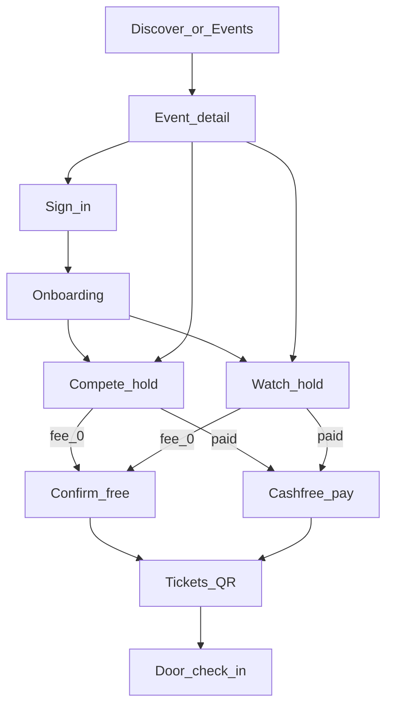
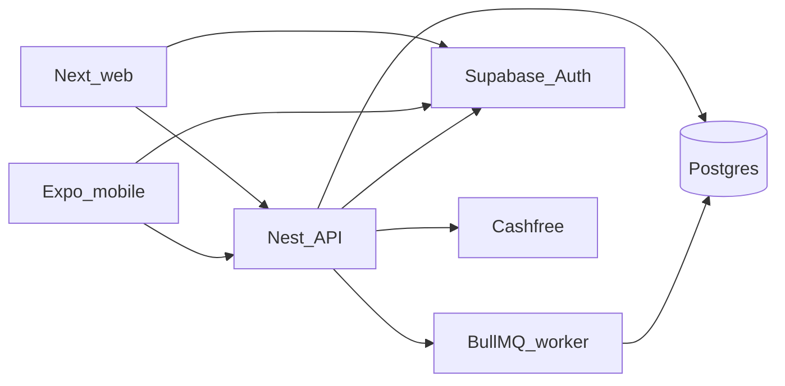

# BYND8 — Product Requirements Document (PRD)

**Product:** BYND8 (spoken: *Beyond Eight*)  
**Marketing site:** [bynd8.in](https://bynd8.in)  
**Clients:** Web (Next.js) + Mobile (Expo)  
**API:** NestJS modular monolith (`apps/api`)  
**Repo packages:** `@cypher/*` (internal); **user-facing brand is always BYND8**  
**Document type:** Full product PRD — vision → v1 → later phases  
**Last updated:** 2026-09-08 (living events · lineup · notifications)  

---

## 0. How to read this document

| Section | Purpose |
|---------|---------|
| **1–3** | Problem, product, principles |
| **4** | Release phasing (**v1 ends at door check-in**) |
| **5–6** | Personas, journeys |
| **7** | Features (live vs planned) — includes **living events, Lineup, notifications** |
| **8–9** | Screens (web + mobile) |
| **10** | Architecture & tech stack |
| **11** | Data model (current + planned) |
| **12** | Payments, tickets, check-in (technical) |
| **13** | Product decisions (locked) |
| **14** | Brand guidelines |
| **15** | Non-goals, risks, success metrics |
| **16** | Related sources |
| **Appendix** | Glossary |

Status legend used below:

- **Live** — shipped in app today (may still harden)  
- **v1** — required for first public product cut (through check-in)  
- **Post-v1** — planned after real organizers use the product  
- **Deferred / parked** — intentional delay  

---

## 1. Problem statement

### 1.1 The scene

India’s competitive and underground dance culture (battles, cyphers, showcases, college events) runs on Instagram posts, WhatsApp groups, Google Forms, spreadsheets, and door cash. Organizers invent a new stack every night. Dancers lose track of entries, payments, and passes. There is no shared, trustworthy record of who entered, who paid, and who showed up.

### 1.2 Pain (dancers)

- Hard to discover what’s actually on (city, style, date) in one place.  
- Registration is fragmented: forms, DMs, venue lists.  
- Paid entry is opaque — “did my UPI land?”  
- No reliable digital pass for the door.  
- No durable history of participation (later: results).

### 1.3 Pain (organizers)

- Capacity and holds are manual and error-prone.  
- Entry fees vs viewers/door fees are mixed with personal accounts.  
- Registration lists live in sheets; media lives on random Drive links.  
- Door check-in is paper or vibes — hard to know who is actually in.  
- **Nights aren’t announced complete.** Judges drop late, DJs get confirmed mid-week, categories open in waves — today that means another IG story and zero structured trail for people who already registered.  
- Running the **floor** (culture) is the job; running **ops** is the tax.

### 1.4 Opportunity

Build the **operating layer around the floor**: discover → register → pay → ticket → **check in** — without pretending to own the culture or replacing the battle itself in v1.

Treat every night as a **living event**: organizers ship what’s ready, then keep updating (lineup, rules, day schedule, viewers pass) — and people who care get **notified** instead of hunting Instagram.

---

## 2. Product description

### 2.1 What BYND8 is

BYND8 is a culture-first platform for the Indian dance scene. It helps dancers **discover and enter** events, and helps organizers **run what happens around the floor** — categories, viewers passes, registrations, payments, tickets, media links, **living updates & lineup**, and (in v1) **door check-in**.

Events are not one-shot listings. Organizers publish early with what they know, then **update over time** (lineup, schedule, fees, media). The product must make that easy — and push the right signals to dancers who follow or hold a ticket.

### 2.2 What BYND8 is not

| Not this | Why |
|----------|-----|
| Only a ticketing app | Culture, discovery, and organizer ops matter as much as QR |
| Only a battle / bracket app | Competition engine is **post-v1** |
| A social network | No feed, DMs, or rankings in v1 |
| Owner of the scene | Principle: **the culture is the centre; BYND8 builds around it** |

### 2.3 Positioning lines

| Role | Line |
|------|------|
| Main | Dance is counted in eights. The scene isn’t. |
| Product | Everything beyond the count. |
| Culture | The count ends. The scene doesn’t. |
| Organizer | You run the floor. We’ll run what’s around it. |

### 2.4 WHO / WHAT / HOW (domain framing)

| Layer | Model | Meaning |
|-------|--------|---------|
| **Who** | `OrganizerType` | Independent, collective, college, studio, community… |
| **What** | `EventType` | Battle, jam, workshop, showcase, cypher… |
| **How** | `EventCategory` + `CategoryEntryType` | 1v1 / 2v2 / open / **viewers pass (`viewer`)** |

College battles are not a separate product — same engine, different context.

---

## 3. Goals & non-goals

### 3.1 Primary goals (v1)

1. Dancers can discover published events and complete **Compete** or **Viewers** registration.  
2. Free and paid paths both end in a **confirmed ticket + QR**.  
3. Organizers can create orgs, events (basics first), then add categories, viewers passes, media, and see registrations.  
4. Paid fees settle to the organizer via Cashfree Easy Split (when connected).  
5. At the door, staff can **scan QR / look up code and check dancers/viewers in**.  

**v1 does not require** full push notifications or a complete Lineup product — but the **living-event edit model** (create basics → keep editing) is already the intended organizer UX and must stay easy.  

### 3.2 Non-goals (v1)

- Brackets, seeding, judging, live battle UI.  
- Verified win history / portfolios as truth.  
- Continuous GPS / map product.  
- Hosted video CDN.  
- Multi-item cart across categories.  
- Team invites / multi-manager org invites (owner-only is enough).  

---

## 4. Release phasing

### 4.1 v1 — “Floor ops through the door” (THIS PRD’s success cut)

**v1 success = dancer has a ticket and can be checked in at the venue.**

| Slice | Includes |
|-------|----------|
| Auth | Google + email magic link; dancer onboarding |
| Discovery | Discover, Events, event detail (Compete / Watch) |
| Registration | Holds, free confirm, paid Cashfree, hold expiry |
| Tickets | Wallet: Needs action / Upcoming / Past + QR |
| Organize | Org profiles; **create basics first** then edit; event browse (tabs) + edit; payouts, regs, media |
| Viewers | First-class viewers pass (`viewer` category) |
| **Check-in (v1 end)** | Organizer/staff scan or manual lookup → mark attendance |

**Living events (product principle, partially live):** organizers must be able to change the night after publish without recreating it. Full **Updates feed**, **Lineup tab**, and **Notifications** ship in the next product slice after check-in (see §7.7) — not blockers for door check-in.

### 4.2 Post-v1 A — Living events + Battle Day ops (after real users)

| Slice | Includes |
|-------|----------|
| **Event Updates** | Organizer posts chronological updates; public Updates on event page |
| **Lineup** | Judges / choreographers / instructors / DJ / emcee / guests — separate **Lineup** tab |
| **Notifications** | In-app (+ push when ready): new event from followed org, event update, lineup change, event starting soon, registration/ticket status |
| Follow | Follow organizer and/or event (drives who gets notified) |
| Battle Day ops | Attendance states, “I’m on my way” + ETA buckets, live event status, staff flows |

**No competition integrity impact from engagement points.**

### 4.3 Post-v1 B — Competition USP

Separate `Competition` from registration categories; brackets, judging, results.

### 4.4 Post-v1 C — Verified history & community

Entry → battles → placement as truth; optional Scene Points / badges (**never** affect judging).

### 4.5 Parked / aside tracks

| Track | Notes |
|-------|--------|
| Phone / WhatsApp OTP | Auth contact only — never canonical user ID |
| Apple Sign In | After Apple Developer Program |
| Pricing tiers / early bird | Date-based then quantity-capped; Nest owns price snapshot (**partially live on edit**) |
| On-site registration channel | Same engine, `ONLINE \| ON_SITE` |
| Staging / EAS | Ops track |
| Map product / video archive / saved list | Venue **pin on event** is in-product; city map product still deferred |

---

## 5. Personas

### 5.1 Dancer / competitor

Wants to find nights, enter a category, pay if needed, show a pass, get checked in.

### 5.2 Viewer / audience

Wants a simple **Viewers pass** — not a battle category picker. Same ticket/QR pipeline.

### 5.3 Organizer / crew owner

Creates org + events, ships a night in pieces (basics → categories → viewers pass → lineup → updates), connects settlement, publishes, manages list, runs door check-in.

### 5.4 Door staff (v1)

May be the owner or a helper with access to check-in UI — scan QR or search registration code.

### 5.5 Lineup person (post-v1 A — soft identity)

Judge, choreographer, instructor, DJ, emcee, guest. May be a free-text name + IG handle first; later optionally linked to a BYND8 `User` / profile. Not a separate auth product in the first Lineup ship.

---

## 6. User journeys

### 6.1 Dancer — discover → ticket → check-in (v1 end-to-end)

```text
Discover / Events
  → Event detail (Compete | Viewers · later: Lineup · Updates)
    → Sign in → Onboarding (if needed)
      → Hold registration
        ├─ ₹0 → Confirm free → Tickets (QR)
        └─ Paid → Phone → Cashfree → Confirm → Tickets (QR)
          → At venue: staff scans QR / code → Checked in
```

### 6.2 Viewer — Viewers pass path

```text
Event detail → Viewers CTA
  → Name (minimal) → Hold (viewer category)
    → Free confirm or Cashfree → Viewers ticket on Tickets
      → Door check-in (same QR verify)
```

### 6.3 Organizer — living night (not one-shot publish)

```text
Sign in → Organize → Create organizer
  → Connect settlement (if fees > ₹0) [web]
  → Create event DRAFT — basics only (title, city, venue±pin, type, start/end, styles)
  → Edit over time (same event — never recreate):
       · Categories (1v1 / 2v2…)
       · Viewers pass
       · Media links
       · Multi-day schedule / deals
       · [Post-v1 A] Lineup tab — judges, DJ, emcee…
       · [Post-v1 A] Post Updates (“Day 2 judges locked”)
  → Publish when ready enough (can still update after publish)
  → Monitor registrations
  → Door: Check-in mode (scan / lookup)
```

**Rule:** Publishing does **not** freeze the event. Post-publish edits are first-class. Destructive changes (cutting a category with sold tickets) stay guarded.

### 6.4 Auth

```text
Google or Email (Supabase)
  → JWT → Nest /me
    → Provision User + AuthIdentity + Profile
      → needsOnboarding? → dancer card → app
```

### 6.5 Journey diagram (v1)



---

## 7. Feature inventory

### 7.1 Auth & identity

| Feature | Status | Notes |
|---------|--------|--------|
| Continue with Google | Live | Supabase → Nest JWT → Cypher `User` |
| Continue with Email | Live | Magic link |
| Dancer onboarding | Live | Name + city required |
| Session / refresh | Live | |
| Apple Sign In | Deferred | Post-v1 / OA |
| Phone / WhatsApp OTP | Parked | Aside **I** |

### 7.2 Discovery & events

| Feature | Status | Notes |
|---------|--------|--------|
| Discover feed + filters | Live | City / type / style / search |
| Events list | Live | |
| Event detail | Live | Compete + Viewers; venue map when pinned |
| External media links | Live | YouTube / IG / Drive — **no hosted video** |
| Event Updates feed | Post-v1 A | Chronological organizer posts |
| Lineup tab | Post-v1 A | Judges / DJ / emcee / … |
| Follow org / event | Post-v1 A | Powers notifications |

### 7.3 Registration & checkout

| Feature | Status | Notes |
|---------|--------|--------|
| Category hold | Live | One active entry per user per category |
| Solo / team | Live | `RegistrationParticipant` |
| Audience / viewer pass | Live | Product copy: **Viewers pass** (`CategoryEntryType.viewer`) |
| Free confirm | Live | |
| Cashfree checkout | Live | Modal + reconcile for local/webhook gaps |
| Hold expiry worker | Live | BullMQ |
| Pricing tiers | Post-v1 / with H | Not v1 blocker |
| Multi-category cart | Non-goal v1 | |

### 7.4 Tickets

| Feature | Status | Notes |
|---------|--------|--------|
| Wallet sections | Live | Needs action / Upcoming / Past |
| QR payload | Live | HMAC `cy1.{registrationId}.{sig}` |
| Audience badge | Live | |
| Door check-in | **v1** | Scan + verify + mark attendance |

### 7.5 Organize

| Feature | Status | Notes |
|---------|--------|--------|
| Create organizer | Live | Creator = owner |
| Org list / dashboard | Live | Browse-first; hide payout wall when ready |
| Event view tabs | Live | Overview · Registrations · Media · Payouts → **+ Lineup · Updates** (Post-v1 A) |
| Event edit route | Live | Forms on `/edit`; create = basics only |
| Viewers pass controls | Live | Toggle + ₹ + capacity |
| Cashfree settlement | Live (web) | Mobile deep-links to web |
| Org member invites | Post-v1 | Owner-only for now |
| Check-in console | **v1** | Per event |
| Post Update | Post-v1 A | Organizer composes update → notify followers/ticket holders |
| Manage Lineup | Post-v1 A | Add/reorder/remove lineup people + roles |

### 7.6 Later product (explicitly post-v1)

| Feature | Phase |
|---------|--------|
| Event Updates + Lineup + Notifications + Follow | **Post-v1 A** (see §7.7) |
| Battle Day attendance states / ETA | Post-v1 A |
| Brackets / judging | Post-v1 B |
| Verified dancer history | Post-v1 C |
| Scene Points / badges | Post-v1 C (never affect judging) |
| City map / proximity product | Deferred (venue pin on event ≠ map product) |
| Hosted video archive | Deferred (`Video` table reserved) |

---

## 7.7 Living events — Updates, Lineup & notifications

**Why this exists:** Dance nights are announced incomplete on purpose. Judges, DJs, day splits, and rules land over days or weeks. Instagram stories don’t give ticket holders a durable trail. BYND8 must make **progressive update** the default organizer motion — same pattern music platforms use for **lineups** and “just announced” alerts (Eventbrite Lineup, Resident Advisor artist tags + follower push).

### 7.7.1 Product principle — living event

| Principle | Meaning |
|-----------|---------|
| Ship what’s ready | Create with basics; add categories / viewers / lineup later |
| Same event ID forever | Never force “new event” for an announcement change |
| Publish ≠ freeze | After publish, organizers still edit; public page reflects latest |
| Signal what changed | Structural edits can auto-suggest an Update; Lineup adds can notify |
| Don’t spam | Bundle noisy edits; respect mute / prefs |

**Organizer UX (target):**

1. **Basics** — title, city, venue±pin, when, styles (live today).  
2. **Tickets** — categories + viewers pass (edit after create — live).  
3. **Lineup** — who’s on the bill (Post-v1 A tab).  
4. **Updates** — short posts when something matters (Post-v1 A).  
5. **Door** — check-in (v1).

### 7.7.2 Event Updates

An **Update** is a short, dated post from the organizer on an event (like a release note for the night).

| Field (concept) | Notes |
|-----------------|--------|
| Title (optional) | e.g. “Judges locked” |
| Body | Plain text; keep short |
| Visibility | Public on event page when event is published |
| Created by | Organizer member |
| Optional link | Reuse `MediaLink` or URL |

**Surfaces**

- Public event: **Updates** section / tab (newest first).  
- Organize event view: compose + edit/delete own updates.  
- Ticket wallet: subtle “New update on {event}” entry into notification inbox.

**Auto-prompt (not auto-spam):** when organizer saves a meaningful change (new lineup person, new category, time change), offer **“Post an Update?”** prefilled — they confirm. Pure typos don’t notify.

### 7.7.3 Lineup

**Lineup** = the people attached to the night who are **not** registration categories. Categories are how you *enter*. Lineup is who’s *running / featuring* on the bill.

| Role (`LineupRole`) | Examples |
|---------------------|----------|
| `judge` | Battle judges |
| `choreographer` | Showcase / workshop |
| `instructor` | Workshop teachers |
| `dj` | House DJ |
| `emcee` | Host / host |
| `guest` | Special guest / featured dancer |
| `other` | Free-label fallback |

**Lineup person fields (v1 of Lineup):**

- Display name (required)  
- Role (required)  
- Optional: IG handle, photo URL, short blurb, sort order  
- Optional later: link to BYND8 `User` / Profile  

**Surfaces**

| Who | Where |
|-----|--------|
| Public | Event page **Lineup** tab — grouped by role or single ordered list |
| Organizer | Event view **Lineup** tab — add / reorder / remove; works on draft + published |

**Rules**

- Lineup can be empty at publish (common).  
- Adding/removing people after publish is normal.  
- Lineup change → optional Update + notification to followers / ticket holders.  
- Lineup is **not** the competition judging product (Post-v1 B). Listing someone as `judge` here is **billing/credit**, not scoring UI.

### 7.7.4 Notifications

**Goal:** tell the right people when something they care about changed — without becoming another noisy social feed.

#### Who gets notified (audience)

| Audience | Default triggers |
|----------|------------------|
| **Ticket holders** (confirmed / open hold) | Event Update posted; lineup change; start time / venue pin change; “starting soon”; check-in opened (optional) |
| **Event followers** | Same as ticket holders for public signals (no payment noise) |
| **Organizer followers** | New event published by that org |
| **Registrant only** | Hold expiring, payment confirmed, refund/cancel |

#### Notification types (catalog)

| Type | Example copy |
|------|----------------|
| `org_event_published` | “{Org} dropped a new night — {Title}” |
| `event_update_posted` | “Update on {Title}: {Update title or snippet}” |
| `lineup_changed` | “Lineup update on {Title} — {Name} added as {Role}” |
| `event_starting_soon` | “{Title} starts in 24h / 2h” (scheduled job) |
| `registration_confirmed` | “You’re in — ticket ready” |
| `hold_expiring` | “Finish payment — spot holds ~X min” |
| `check_in_open` | Optional: “Door check-in is live” |

#### Channels (phased)

| Channel | Phase |
|---------|--------|
| In-app inbox + badge | Post-v1 A first ship |
| Mobile push (Expo) | Post-v1 A once inbox works |
| Email digest | Optional later — not WhatsApp OTP |
| SMS | Parked (cost / I track) |

#### Preferences

- Per-user toggles: org follows, event reminders, marketing-like “new in your city” (off by default).  
- Ticket-critical messages (confirm, hold expiry) stay on unless we add an advanced mute.  
- Quiet hours optional later.

#### Scheduling / “about to happen”

Worker jobs (BullMQ, same family as hold expiry):

- `T-24h` and `T-2h` before `Event.startTime` (or first `EventDay`) for ticket holders + followers.  
- Idempotent per user × event × window.

### 7.7.5 Follow model

| Follow | Effect |
|--------|--------|
| Follow **Organizer** | Notify on new published events |
| Follow **Event** | Notify on Updates, lineup, starting soon |
| Hold / ticket | Implicit follow of that event for ticket-critical + update signals |

Unfollow anytime. No public follower counts required in first ship.

### 7.7.6 What we learn from other platforms (and what we skip)

| Pattern (RA / Eventbrite) | BYND8 take |
|---------------------------|------------|
| Lineup / artist tags drive discovery + alerts | Yes — Lineup roles fit dance (judge/DJ/emcee), not only “artists” |
| Follow promoter → new event push | Yes — Follow Organizer |
| Auto-post to Spotify etc. | **No** for v1/Post-v1 A — stay on BYND8 + optional share link |
| Ranking SEO games | Out of scope |

### 7.7.7 Delivery order (recommended)

1. Keep **easy edit after create** (already shipping).  
2. **Lineup** tab (organizer + public) — high cultural value, low infra.  
3. **Updates** posts on event.  
4. **In-app notifications** + Follow.  
5. **Push** + starting-soon jobs.  
6. Deeper Battle Day ops on top of the same notification bus.

---

## 8. Screens — web

**Primary nav (live):** Discover · Events · Organize · Tickets · Profile  

### 8.1 Public / guest

| Screen | Route | Description |
|--------|-------|-------------|
| Discover | `/discover` | Scene feed, filters, featured |
| Events | `/events` | Published grid |
| Event detail | `/events/[slug]` | Compete / Viewers; venue map; later Lineup + Updates tabs |
| Login | `/login` | Brand-led Google + email |
| Auth callback | `/auth/callback` | OAuth / magic-link exchange |
| Cashfree pay | `/pay/cashfree` | Checkout handoff |
| Notifications inbox | `/notifications` | **Post-v1 A** — in-app feed |

### 8.2 Authenticated

| Screen | Route | Description |
|--------|-------|-------------|
| Profile | `/profile` | Onboarding or profile + sign out |
| Tickets | `/tickets` | Wallet + QR |
| Organize home | `/organize` | Org profile cards |
| New organizer | `/organize/new` | Create crew |
| Org dashboard | `/organize/[slug]` | Events list; settlement when needed |
| New event | `/organize/[slug]/events/new` | **Basics only** → redirect to edit |
| Event view | `/organize/[slug]/events/[eventId]` | Tabs: Overview / Regs / Media / Payouts / **Lineup** / **Updates** |
| Event edit | `/organize/[slug]/events/[eventId]/edit` | Forms + categories + viewers + map |
| **Check-in** | `/organize/[slug]/events/[eventId]/check-in` | **v1** — scan / lookup / mark in |

### 8.3 Redirected (not product)

`/map`, `/videos`, `/organizers`, `/saved` → `/discover`.

---

## 9. Screens — mobile

**Tabs:** Discover · Events · Tickets · Organize · Profile  

| Screen | Path | Description |
|--------|------|-------------|
| Discover / Events / Event detail | tabs + `event/[id]` | Compete / Viewers; later Lineup + Updates |
| Tickets | `(tabs)/tickets` | Needs action / Upcoming / Past |
| Organize list / org / event view | organize… | Tabs + Edit; **Lineup** / **Updates** tabs Post-v1 A |
| Event edit | `…/events/[id]/edit` | Basics + categories + viewers + map |
| Notifications | inbox screen / tab badge | **Post-v1 A** |
| Profile / auth callback | profile, `auth/callback` | |
| **Check-in** | `…/events/[id]/check-in` | **v1** — camera scan preferred |

**Note:** Full Cashfree **vendor / settlement setup** remains web-first; mobile may deep-link.

---

## 10. Architecture & technical stack

### 10.1 Shape

**Modular monolith** (Nest modules) + **background worker** (BullMQ) + **Postgres** (Prisma, PostGIS available).  
Not microservices in v1.



### 10.2 Stack

| Layer | Choice |
|-------|--------|
| Web | Next.js App Router, Tailwind, local UI kit |
| Mobile | Expo Router, NativeWind |
| API | NestJS + Fastify adapter |
| ORM | Prisma |
| DB | PostgreSQL (+ PostGIS extension) |
| Auth | Supabase Auth (JWT); Nest verifies and maps to Cypher `User` |
| Payments | Cashfree PG + Easy Split vendors |
| Queues | Redis + BullMQ (hold expiry, payment split, later: notify fan-out + starting-soon) |
| Contracts | `packages/contracts`, `packages/api-client`, `packages/utils`, `packages/tokens` |

### 10.3 AuthZ rule

- Clients never write domain tables with the user JWT as DB role for business writes.  
- Nest is the authorization boundary.  
- After JWT verify: `AuthIdentity` → **`request` Cypher `userId` only** in domain services.

### 10.4 Monorepo apps

| App / package | Role |
|---------------|------|
| `apps/web` | Dancer + organizer web |
| `apps/mobile` | Expo client |
| `apps/api` | Nest HTTP API |
| `apps/worker` | Background jobs |
| `packages/*` | Shared contracts, client, utils, tokens |

### 10.5 Environments

| Concern | Notes |
|---------|--------|
| Local | API often `127.0.0.1` — Cashfree webhooks cannot reach it → **reconcile** order status from client |
| Staging / prod | Public `notify_url` + signed webhooks; reconcile remains a safety net |

---

## 11. Data model

Source of truth for **current** schema: [`prisma/schema.prisma`](../../prisma/schema.prisma).

### 11.1 Identity

| Model | Purpose |
|-------|---------|
| `User` | Canonical Cypher ID — all domain FKs |
| `AuthIdentity` | External auth (`SUPABASE` + `providerUserId`) |
| `Profile` | Dancer-facing card (name, city, crew, styles, `onboardedAt`) |
| `DanceStyle` / joins | Shared style taxonomy for profiles & events |

**Rule:** Phone is never the canonical ID.

### 11.2 Organize

| Model | Purpose |
|-------|---------|
| `Organizer` | Crew / org profile |
| `OrganizerMember` | Roles: owner / manager / editor |
| `OrganizerPaymentAccount` | Cashfree vendor + `payoutReady` |

### 11.3 Events & categories

| Model | Purpose |
|-------|---------|
| `Event` | Night card — type, city, venue±coords, times, poster, status |
| `EventCategory` | Compete category **or** viewers pass (`entryType`: solo / team / **viewer**) |
| `EventDay` / `EventCategoryDay` | Multi-day schedule + which days a pass is valid for |
| `CategoryPriceTier` | Cheaper-until-date / regular pricing |
| `EventDanceStyle` | Style tags |
| `MediaLink` | External URLs; `battleId` reserved for later |
| `Video` | Reserved YouTube-oriented archive (product UI deferred) |

**Viewers rule:** at most **one** simple viewers pass per event unless multi-day generation creates day / full-run viewer categories (API-defined).

### 11.4 Registration & tickets

| Model | Purpose |
|-------|---------|
| `Registration` | Hold / confirmed entry; amount snapshot; `registrationCode`; `ticketQrToken` (hash) |
| `RegistrationParticipant` | Solo/team names; optional linked `userId` |

Statuses (registration): `pending_payment` · `confirmed` · `waitlist` · `expired` · `cancelled` · `refunded`.

### 11.5 Payments

| Model | Purpose |
|-------|---------|
| `PaymentOrder` | Provider order / session |
| `Payment` | Captured payment rows |
| `PaymentWebhookEvent` | Idempotent webhook ingest |

### 11.6 Platform

| Model | Purpose |
|-------|---------|
| `AuditLog` | Actor + entity actions |

### 11.7 Planned for v1 check-in (to add when implementing)

| Concept | Intent |
|---------|--------|
| Attendance / check-in record | Link `registrationId` + `checkedInAt` + `checkedInByUserId` (+ optional channel `SCAN` / `MANUAL`) |
| Idempotent check-in | Re-scan of already checked-in → soft success, no double count |

Do **not** invent Battle Day attendance state machine schema until Post-v1 A.

### 11.8 Planned post-v1 (do not build early)

| Concept | Phase | Intent |
|---------|--------|--------|
| `EventUpdate` | Post-v1 A | Chronological organizer posts on an event |
| `EventLineupPerson` + `LineupRole` | Post-v1 A | Judges, DJ, emcee, instructors…; sortOrder; optional user link later |
| `Follow` (organizer / event) | Post-v1 A | Who receives non-ticket notifications |
| `Notification` (+ read state) | Post-v1 A | In-app inbox rows; channel metadata for push |
| `NotificationPreference` | Post-v1 A | User toggles |
| Competition / bracket / round entities | Post-v1 B | |
| Battle Day presence states (`ON_THE_WAY`, etc.) | Post-v1 A | |
| Scene Points | Post-v1 C | |

**Suggested `LineupRole` enum:** `judge` · `choreographer` · `instructor` · `dj` · `emcee` · `guest` · `other`

**Edit UX (live):** After create, land on edit with a **next-steps checklist** (categories needed to publish; viewers / poster / pin / media optional). Details stay on the edit screen — not a separate wizard until we choose to build one.

### 11.9 Key enums (current)

- `CategoryEntryType`: `solo` | `team` | `viewer`  
- `EventStatus`: `draft` | `published` | `registration_closed` | `completed` | `cancelled`  
- `EventType`: battle, workshop, jam, showcase, cypher, …  
- `OrganizerType`: independent, collective, college, studio, community, other  
- Payment / payout / webhook enums — see schema  

---

## 12. Critical flows (technical)

### 12.1 Capacity

- Capacity counts **entries** (registrations), not headcount.  
- `reservedCount` for holds; `confirmedCount` for confirmed.  
- Expiry worker releases unpaid holds.

### 12.2 Free vs paid confirm

| Path | Mechanism |
|------|-----------|
| Free | `POST …/confirm-free` → issue ticket hash → `confirmed` |
| Paid | Cashfree order → webhook **and/or** client **reconcile** → same confirm path |

### 12.3 Ticket QR

- Payload: `cy1.{registrationId}.{HMAC-SHA256}` over `ticket:v1:{registrationId}`  
- Store **hash only** (`ticketQrToken`)  
- Deterministic per registration → unique across entries; forge-resistant without signing secret  
- Check-in: `verifyPayload` → load registration → must be `confirmed` → mark attendance  

### 12.4 Viewers pass

- Product name: **Viewers pass** (schema: `CategoryEntryType.viewer`).  
- Organizer sets toggle + price + capacity → syncs viewer category (or multi-day day / full-run set).  
- Public UI: **Viewers** separate from **Compete**.  
- Same hold → pay → QR → check-in pipeline.

### 12.5 Settlement

- Paid categories / paid viewers require `OrganizerPaymentAccount.payoutReady`  
- Free ₹0 never requires bank  

### 12.6 Living updates (Post-v1 A — technical sketch)

- Writes go through Nest (same AuthZ as organize).  
- Creating `EventUpdate` / lineup mutation enqueues notification fan-out (BullMQ).  
- Starting-soon reminders: scheduled jobs keyed by `eventId` + window; cancel/reschedule on `startTime` change.  
- Push tokens stored per device later; inbox rows are source of truth if push fails.

---

## 13. Locked product decisions (summary)

| Topic | Decision |
|-------|----------|
| Canonical user | Cypher `User.id` |
| Auth providers v1 | Google + email via Supabase |
| Org create | Any onboarded user → owner |
| Members v1 | Owner-only |
| Registration | One active entry per category |
| Price authority | Nest / server |
| Media | Links only — no hosted video |
| Create event | Basics first; categories / viewers on edit |
| Living event | Publish does not freeze; progressive updates are first-class |
| Lineup vs categories | Lineup = who’s on the bill; categories = how you enter |
| Viewers pass | Product name for `viewer` entry type |
| v1 money | Free + Cashfree paid supported |
| Check-in | **In v1** (ops); competition gate later can reuse attendance |
| Updates / Lineup / Notifications | **Post-v1 A** (after check-in); design locked in §7.7 |
| Battle Day / brackets | After first releases + real organizers |
| Phone as ID | Rejected |

---

## 14. Brand guidelines

### 14.1 Voice

Culture-first, clear, underground-aware — not generic SaaS.  
Use **scene vocabulary** where it helps (cypher, 1v1/crew, prelims, exhibition, props, handshake) — never invent fake slang.  
Do not claim check-in / battle / history as live until shipped.  
Do not position BYND8 as owner of the scene.  
Scene education language (formats / judging / culture terms) lives in code as `scene-lexicon` — see Appendix B.

### 14.2 Logo

Mark fuses **B** + **8**:

- 8 = movement (counts)  
- 8 = circles (cyphers)  
- 8 = continuity (8 → ∞)  

System idea: **8 → ○ ○ → ∞**

**Avoid:** stretch/skew/shadows, dancer silhouette as mark, random graffiti fonts.

**Assets:** `apps/web/public/brand/*`, `apps/mobile/assets/brand/*`, OG `og/bynd8-og.png`.

### 14.3 Color

| Role | Hex | Use |
|------|-----|-----|
| Near black | `#0B0B0B` | Environment |
| Off white | `#F4F2ED` | Text / light surfaces |
| Burnt orange | `#FF6800` | **Scene energy** — CTAs, live, featured |
| Acid lime | `#C7FF00` | **System** — confirmed, success (sparingly) |

Orange = energy · Lime = infrastructure · Black dominates.

### 14.4 Typography

| Role | Family |
|------|--------|
| Display | Bebas Neue |
| UI / body | Barlow |

~70% clean editorial / 30% underground energy.

### 14.5 Copy cues

| Context | Direction |
|---------|-----------|
| Discovery | Find the cipher / upcoming battles & cyphers |
| Register | Compete categories (1v1, crew, prelims) / get in |
| Viewers | Viewers pass — presence without entering |
| Tickets | You’re on the list / show this at the door |
| Check-in | In / checked — handshake after the round |
| Organize | You run the floor — we’ll run what’s around it |
| Culture | Props earned · no biting · respect after |

### 14.6 Brand decision filter

1. Culture at the centre?  
2. Claiming unshipped features?  
3. Orange vs lime used correctly?  
4. Feels at home next to bynd8.in?  
5. Scene terms used honestly (not cosplay slang)?  

### 14.7 Support

Prefer `@bynd8.in` (e.g. `support@bynd8.in`). Don’t invent fake WhatsApp desks in copy.

---

## 15. Success metrics, risks, open questions

### 15.1 v1 success metrics (suggested)

- Organizers with ≥1 published event  
- Confirmed registrations (compete + audience)  
- Paid conversion rate (holds → paid confirmed)  
- Check-in rate on event day (checked-in / confirmed)  
- Time-to-first-publish for new organizers  

### 15.2 Risks

| Risk | Mitigation |
|------|------------|
| Webhook unreliability locally | Reconcile API |
| Settlement KYC friction | Clear web-only payout UX + sandbox hints |
| Scope creep into brackets | Hard gate: v1 ends at check-in |
| QR forgery | HMAC + hash-at-rest |

### 15.3 Open / implement-time choices (check-in)

- Camera scan library on mobile vs web-only scanner first  
- Whether managers/editors can check in (likely yes)  
- Offline / flaky network door mode (nice-to-have, not v1 blocker)  

### 15.4 Open choices (Lineup / notifications — Post-v1 A)

- Lineup first as free-text names only vs soft-link to BYND8 profiles on day one  
- Public event: Lineup as **tab** vs section under Overview (PRD prefers **tab**)  
- Auto-notify on every lineup edit vs only when organizer confirms “Post Update”  
- Starting-soon windows: 24h + 2h enough, or add morning-of?  
- City-wide “new events near you” digest — off by default if we ship it  

---

## 16. Related sources

| Source | Path / URL |
|--------|------------|
| Marketing | https://bynd8.in |
| This PRD | `docs/product/BYND8_PRODUCT_JOURNEY_AND_BRAND.md` |
| Technical blueprint (legacy name) | `Dance_Platform_Blueprint_Cursor_NestJS.md` |
| Prisma schema | `prisma/schema.prisma` |
| Tokens | `packages/tokens` |
| Local milestone tracker | `MILESTONE_TRACKER.local.md` (gitignored — do not commit) |

---

## Appendix A — Glossary

| Term | Meaning |
|------|---------|
| Hold | Temporary reservation (`pending_payment`) before confirm/pay |
| Compete / Category | Solo/team battle/entry categories (how you register) |
| Viewers pass | `viewer` category — watch the night, don’t enter a battle category |
| Lineup | People on the bill (judge, DJ, emcee, instructor…) — **not** a registration category |
| Update | Short organizer post on a living event (“judges locked”) |
| Follow | Opt-in to org/event signals for notifications |
| Settlement | Cashfree vendor payout destination |
| Ticket QR | Signed payload for door verify |
| Check-in | Mark confirmed registration as present at venue |
| Living event | Night that keeps changing after first announce/publish |
| Battle Day | Post-v1 ops/competition layer |

---

## Appendix B — Scene lexicon (product copy)

Source of truth in code: `packages/utils/src/scene-lexicon.ts` (exported from `@cypher/utils`).

These are **common underground battle terms** used in BYND8 UI hints, category chips, and brand voice. Educational framing in the Indian scene (e.g. Dance Mentor India / `@dancementorindia`) informed this vocabulary; BYND8 does **not** claim ownership of third-party branded carousels.

### Formats

| Term | Definition |
|------|------------|
| Cypher | Open circle freestyle. No judges. Just respect. |
| Prelims | Solo showcase round to qualify for the bracket. |
| 1v1 / Crew | The format — solo, pairs, or full crew against another. |
| Call out | Publicly challenging one specific dancer. |
| Exhibition | Battle for the culture, not the trophy. |

### Judging

| Term | Definition |
|------|------------|
| Point | Judges point toward who they felt won. |
| Unanimous | All judges same way. Clean win. |
| Split decision | Judges disagree — the close ones. |
| Foundation check | Basics real or borrowed? |
| Crowd reaction | Not a score. Changes the room. |

### Execution

| Term | Definition |
|------|------------|
| Freestyle | In the moment, not rehearsed. |
| Set | Prepared sequence — use it, don’t depend on it. |
| Blow up | Explosive high-energy moment in a round. |
| Get down | Drop to floor level. |
| Vocabulary | Your library of moves. |

### Culture & respect

| Term | Definition |
|------|------------|
| Biting | Copying someone’s signature as your own — loses respect fast. |
| Props | Respect given. Earned, never demanded. |
| Burn | Answer so hard the round is basically done. |
| OG | Veteran who built the scene before you. |
| Handshake | Battle ends when the round ends. Respect after, always. |

### Strategy

| Term | Definition |
|------|------------|
| Reading | Watching opponent gaps. |
| Answer | Your version of their move — higher level. |
| Pacing | Don’t empty everything in round one. |
| Bombs | Strongest moves — timing > the move. |
| Composure | Calm when the crowd gets loud. |

### Energy & presence

| Term | Definition |
|------|------------|
| Attack | How you enter — first three seconds. |
| Character | Personality through movement. |
| Presence | Own space without forcing it. |
| Momentum | Energy that builds across the round. |
| Choking | Freezing under pressure — train for it. |

**Where it shows up now:** event-type hints, category name chips (1v1 / Crew / Prelims / Exhibition…), Discover / Compete / onboarding copy. **Later:** Lineup judge context, Battle Day judging UI, optional in-app glossary screen.

---

*BYND8 PRD — full arc from problem through post-v1 vision. **v1 delivery cut: through door check-in.** Living events / Lineup / notifications are designed in §7.7 for Post-v1 A. Update this file when scope, schema, or brand tokens change.*
